# Documentation: Converting BControl Data to NWB with ndx-structured-behavior

## Background

Modern neuroscience experiments often use behavioral control systems like BControl to run complex tasks.
These systems typically implement finite state machines (FSMs) to manage experimental states, detect subject-triggered
events (e.g., port pokes), and control outputs (actions). However, the resulting data formats are heterogeneous
and often difficult to analyze or share.

The [ndx-structured-behavior](https://github.com/rly/ndx-structured-behavior) NWB extension was developed to address
this challenge ([Roth et al., 2024](https://www.biorxiv.org/content/10.1101/2024.01.08.574597v1.full)). It provides a
standardized schema for representing behavioral data from FSM-based protocols, making it easier to store, query, and
analyze across labs and experiments.

Key concepts from the extension:
- **States**: Discrete phases or conditions of the behavioral task (e.g., "wait_for_poke", "reward").
- **Events**: Timestamped occurrences, typically triggered by the subject (e.g., nose pokes).
- **Actions**: Outputs or transitions initiated by the system (e.g., sound played).
- **Trials**: Segments of the experiment, each referencing the relevant states, events, and actions.

## How ndx-structured-behavior works

The extension introduces several NWB tables:
- **StateTypesTable**: Names and descriptions of all possible states.
- **StatesTable**: Start/stop times for each state occurrence.
- **EventTypesTable**: Names and descriptions of all event types.
- **EventsTable**: Timestamps and values for each event.
- **ActionTypesTable**: Names and descriptions of all action types.
- **ActionsTable**: Timestamps and values for each action.
- **TrialsTable**: Each trial references the states, events, and actions that occurred within its interval.
- **TaskArgumentsTable**: Stores task parameters and their descriptions.

## Mapping BControl Data to NWB

BControl stores behavioral data in MATLAB `.mat` files, with two main structures:
- `saved`: Contains task parameters, metadata, and session info.
- `saved_history`: Contains trial-by-trial parsed events (`ProtocolsSection_parsed_events`) and task parameters.

### Step-by-Step Conversion

1. **Session Metadata Extraction**
   - Extract protocol title and save time from `saved` to determine `session_start_time`.
   - Parse subject and session identifiers from the file name.

2. **Trial-by-Trial Data Extraction**
   - For each trial in `saved_history["ProtocolsSection_parsed_events"]["states"]`:
     - **States**: Extract state names and their enter/exit times. Populate `StateTypesTable` and `StatesTable`.
   - For each trial in `saved_history["ProtocolsSection_parsed_events"]["pokes"]`:
     - **Events**: Extract event names and timestamps (with duration). Populate `EventTypesTable` and `EventsTable`.
    - For each trial in `saved_history["ProtocolsSection_parsed_events"]["waves"]`:
     - **Actions**: Extract action names and timestamps (with duration). Populate `ActionTypesTable` and `ActionsTable`.

3. **Trials Table Construction**
   - For each trial, determine start/stop times from the starting state ("state_0").
   - Reference relevant states, events, and actions by index.

4. **Task Arguments**
   - For each parameter in `saved`, add to `TaskArgumentsTable` if scalar.
   - For array-type parameters, add as columns to `TrialsTable`.
   - Descriptions can be provided via a YAML file generated from MATLAB code. (see src/pagan_lab_to_nwb/arc_behavior/utils/notes.md for details on generating this YAML).

### Example Table Relationships

```mermaid
%%{init: {'theme': 'base', 'themeVariables': {'primaryColor': '#ffffff', 'primaryBorderColor': '#144E73', 'lineColor': '#D96F32'}}}%%
classDiagram
    direction TB

    class TaskRecording {
        <<NWBDataInterface>>
        --------------------------------------
        groups
        --------------------------------------
        events : EventsTable
        states : StatesTable
        actions : ActionsTable
    }

    class Task {
        <<LabMetaData>>
        --------------------------------------
        datasets
        --------------------------------------
        TaskProgram : optional
        TaskSchema : optional
        --------------------------------------
        groups
        --------------------------------------
        event_types : EventTypesTable
        state_types : StateTypesTable
        action_types : ActionTypesTable
        task_arguments : TaskArgumentsTable
    }

    class TrialsTable {
        <<TimeIntervals>>
        --------------------------------------
        datasets
        --------------------------------------
        states : DynamicTableRegion
        states_index : VectorIndex, optional
        events : DynamicTableRegion
        events_index : VectorIndex, optional
        actions : DynamicTableRegion
        actions_index : VectorIndex, optional
    }

    class StateTypesTable {
        <<DynamicTable>>
        --------------------------------------
        datasets
        --------------------------------------
        state_name : VectorData
    }

    class StatesTable {
        <<TimeIntervals>>
        --------------------------------------
        datasets
        --------------------------------------
        state_type : DynamicTableRegion
    }

    class EventTypesTable {
        <<DynamicTable>>
        --------------------------------------
        datasets
        --------------------------------------
        event_name : VectorData
    }

    class EventsTable {
        <<DynamicTable>>
        --------------------------------------
        datasets
        --------------------------------------
        timestamp : VectorData, float32
        event_type : DynamicTableRegion
        value : VectorData, text
    }

    class ActionsTable {
        <<DynamicTable>>
        --------------------------------------
        datasets
        --------------------------------------
        timestamp : VectorData, float32
        action_type : DynamicTableRegion
        value : VectorData, text
    }

    class ActionTypesTable {
        <<DynamicTable>>
        --------------------------------------
        datasets
        --------------------------------------
        action_name : VectorData
    }

    class TaskArgumentsTable {
        <<DynamicTable>>
        --------------------------------------
        datasets
        --------------------------------------
        argument_name : VectorData, text
        argument_description : VectorData, text
        expression : VectorData, text
        expression_type : VectorData, text
        output_type : VectorData, text
    }

    Task *-- EventTypesTable : contains
    Task *-- StateTypesTable : contains
    Task *-- ActionTypesTable : contains
    Task *-- TaskArgumentsTable : contains
    TaskRecording *-- EventsTable : contains
    TaskRecording *-- StatesTable : contains
    TaskRecording *-- ActionsTable : contains

```



---

## Example Usage

See `convert_session.py` for a script to convert a session:

```python
from pagan_lab_to_nwb.arc_behavior.convert_session import session_to_nwb

session_to_nwb(
    file_path="path/to/data.mat",
    nwb_folder_path="path/to/output",
    task_params_file_path="path/to/task_params.yaml",
    stub_test=False,
    overwrite=True,
)
```

## References

- [ndx-structured-behavior](https://github.com/rly/ndx-structured-behavior)
- [Roth et al., 2024, bioRxiv](https://www.biorxiv.org/content/10.1101/2024.01.08.574597v1.full)
- [NeuroConv](https://github.com/catalystneuro/neuroconv)
