# Notes concerning the conversion of the TaskSwitch6 protocol

## Task Schema mapping to NWB

I think we should eliminate the `TaskSchema` class since we don't a schema per se only .m files that define the task program.

```mermaid
%%{init: {'theme': 'base', 'themeVariables': {'primaryColor': '#ffffff', 'primaryBorderColor': '#144E73', 'lineColor': '#D96F32'}}}%%

classDiagram
    direction TB


    class TaskProgram {
        <<NWBContainer>>
        --------------------------------------
        attributes
        --------------------------------------
        description : text
        language : text = "Matlab"
        --------------------------------------
        groups
        --------------------------------------
        program_sections : ProgramSection[1..*]

    }

    class ProgramSection {
        <<NWBData>>
        --------------------------------------
        attributes
        --------------------------------------
        language : text = "Matlab"
    }

    class TaskRecording {
        <<NWBDataInterface>>
        --------------------------------------
        groups
        --------------------------------------
        events : EventsTable
        states : StatesTable
        actions : ActionsTable
    }

    class Task {
        <<LabMetaData>>
        --------------------------------------
        datasets
        --------------------------------------
        TaskProgram : optional
        --------------------------------------
        groups
        --------------------------------------
        event_types : EventTypesTable
        state_types : StateTypesTable
        action_types : ActionTypesTable
    }


    class TrialsTable {
        <<TimeIntervals>>
        --------------------------------------
        datasets
        --------------------------------------
        states : DynamicTableRegion
        states_index : VectorIndex, optional
        events : DynamicTableRegion
        events_index : VectorIndex, optional
        actions : DynamicTableRegion
        actions_index : VectorIndex, optional
    }

    class StateTypesTable {
        <<DynamicTable>>
        --------------------------------------
        datasets
        --------------------------------------
        state_name : VectorData
    }

    class StatesTable {
        <<TimeIntervals>>
        --------------------------------------
        datasets
        --------------------------------------
        state_type : DynamicTableRegion
    }

    class EventTypesTable {
        <<DynamicTable>>
        --------------------------------------
        datasets
        --------------------------------------
        event_name : VectorData
    }

    class EventsTable {
        <<DynamicTable>>
        --------------------------------------
        datasets
        --------------------------------------
        timestamp : VectorData, float32
        event_type : DynamicTableRegion
        value : VectorData, text
    }

    class ActionsTable {
        <<DynamicTable>>
        --------------------------------------
        datasets
        --------------------------------------
        timestamp : VectorData, float32
        action_type : DynamicTableRegion
        value : VectorData, text
    }

    class ActionTypesTable {
        <<DynamicTable>>
        --------------------------------------
        datasets
        --------------------------------------
        action_name : VectorData
    }

    class TaskArgumentsTable {
        <<DynamicTable>>
        --------------------------------------
        datasets
        --------------------------------------
        name : VectorData, text
        description : VectorData, text
        --------------------------------------
        groups
        --------------------------------------
        program_section : ProgramSection
    }

    TaskProgram *-- ProgramSection : contains
    TaskArgumentsTable *-- ProgramSection : links to
    Task *-- TaskProgram : contains
    Task *-- EventTypesTable : contains
    Task *-- StateTypesTable : contains
    Task *-- ActionTypesTable : contains
    Task *-- TaskArgumentsTable : contains
    TaskRecording *-- EventsTable : contains
    TaskRecording *-- StatesTable : contains
    TaskRecording *-- ActionsTable : contains
```

